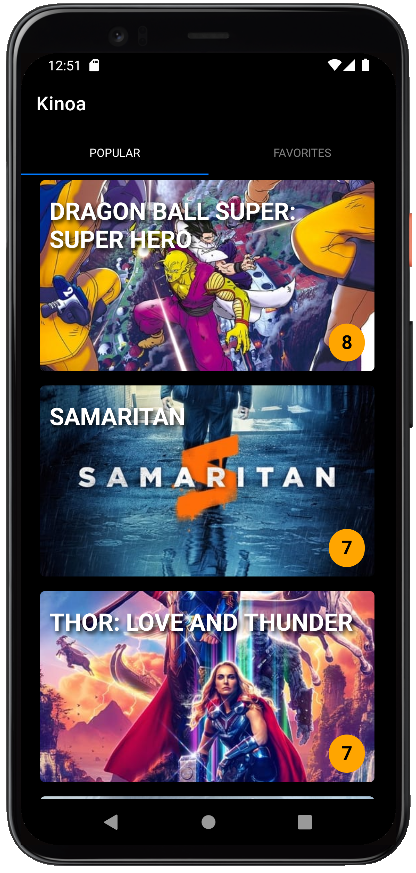
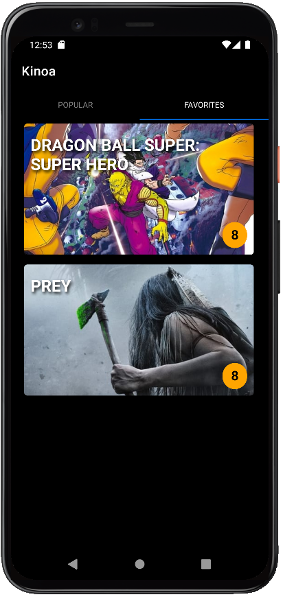

# Kinoa

**Meaning:** Contraction du grec ancien κίνημα (« mouvement »), et de Quinoa.

This movie application project was built with **React** and **Expo** et **SQLite** .

## Features

In this app, you can:

### `Browse the most popular movies`

User can display the most popular movies using the The Movie Database API.

### `Favorites`

The user can save the movies in Favorites by toggling a switch. The movie's info are stored in a SQLite database.

### `Watch the trailer`

User can watch the trailer of a movie (The Movie Database API) .

## Important

In order for the app and the fetch to work, the API_KEY must be replaced with your own credentials.

In this project, for security purposes, the API_KEY was added in a env file that was included in a .gitignore file.

## Demo

  
